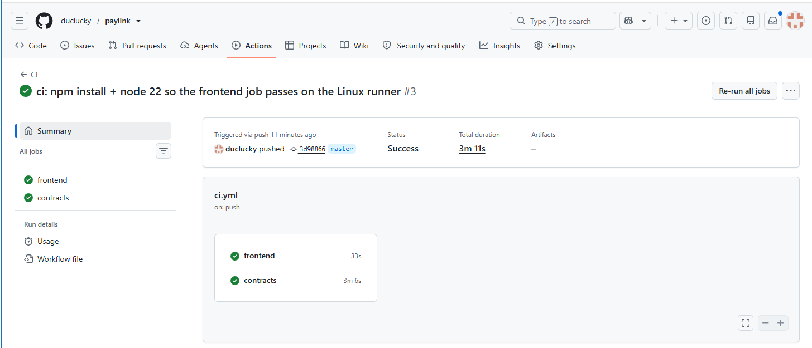
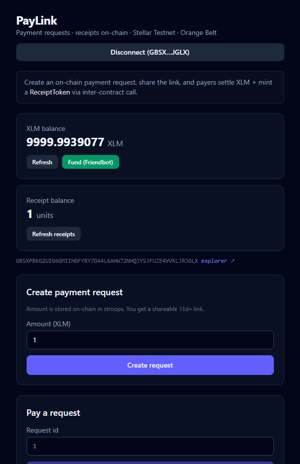
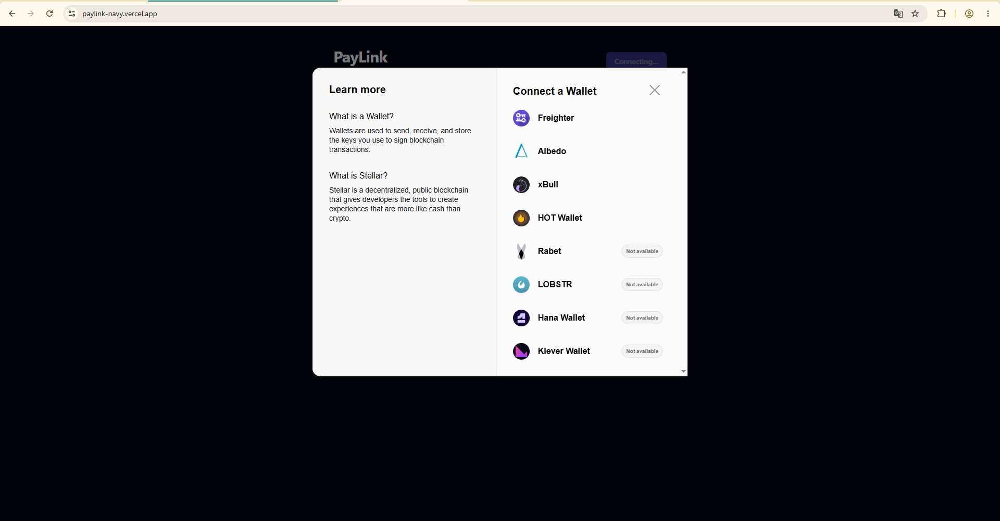
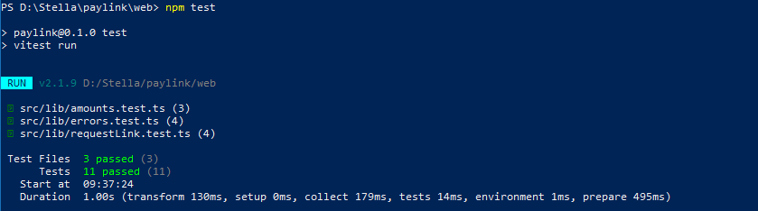

https://github.com/user-attachments/assets/83c0522f-11e1-4ad9-886b-23e64f041f20

# PayLink

**PayLink** is a payment-request dApp on the Stellar **Testnet**: a creator makes a
request for a specific XLM amount; anyone opens the shareable link and pays; the
request tracks paid/unpaid status live; paying issues an on-chain **receipt** via
**inter-contract communication** (`PayRequest` → `ReceiptToken.mint`).

Built for Rise In **Stellar Journey to Mastery — Level 3 / Orange Belt**.

## Live demo

**[paylink-navy.vercel.app](https://paylink-navy.vercel.app/)** (Stellar Testnet)

## Features

- **Multi-wallet** connect/disconnect via StellarWalletsKit (Freighter, xBull, Albedo, Lobstr, …)
- XLM balance + **Friendbot** funding
- **Create** an on-chain payment request → shareable `?id=<n>` link
- **Pay** a request: classic XLM settlement + contract `pay` (pending → success/fail)
- **ReceiptToken** balance after pay (proves inter-contract mint)
- **Live events** polled from Soroban RPC (`created` / `paid`)
- Loading + error states; **mobile-responsive** layout
- Classic send-XLM primitive (collapsible)
- Contract tests + frontend Vitest + **GitHub Actions CI**

## Architecture

```
┌──────────────┐  create / pay / get   ┌──────────────┐
│   Frontend   │ ───────────────────►  │  PayRequest  │
│ React + Kit  │                       │  (Soroban)   │
└──────────────┘                       └──────┬───────┘
       │ classic XLM (fallback)               │ pay → receipt.mint
       ▼                                      ▼
  Horizon payment                      ┌──────────────┐
                                       │ ReceiptToken │
                                       └──────────────┘
```

### Value transfer

**Fallback (in use):** the frontend sends a classic XLM `payment` to the creator,
then calls `pay(id, payer)` to mark the request paid, emit `paid`, and mint a
receipt via inter-contract call. Native SAC settlement is not used in this build.

## Deployed contracts (testnet — real)

| Contract | Address |
|----------|---------|
| **ReceiptToken** | [`CC5ULTHI54XPDNBM2M2CELK57SAAHW6AISJOYIJXB3PM4KBVRQDRVI2P`](https://stellar.expert/explorer/testnet/contract/CC5ULTHI54XPDNBM2M2CELK57SAAHW6AISJOYIJXB3PM4KBVRQDRVI2P) |
| **PayRequest** | [`CCVP6RWEZGZEFU74BQOBYO7RYATWL5LX3UAVRLY7R36I3QHZ7VTCFY2G`](https://stellar.expert/explorer/testnet/contract/CCVP6RWEZGZEFU74BQOBYO7RYATWL5LX3UAVRLY7R36I3QHZ7VTCFY2G) |

| Evidence | Value |
|----------|--------|
| **Contract `pay` tx** (cross-call) | [`c162a1eea1b6a3d700a2f3397e1a609cb355dd1c7b08db4761d5241425686264`](https://stellar.expert/explorer/testnet/tx/c162a1eea1b6a3d700a2f3397e1a609cb355dd1c7b08db4761d5241425686264) |
| **Create request tx** | [`e672cc70721db26050cbfd8f8a8bd174c68ade2eac3572fec3e6cfa6f3fec7ee`](https://stellar.expert/explorer/testnet/tx/e672cc70721db26050cbfd8f8a8bd174c68ade2eac3572fec3e6cfa6f3fec7ee) |
| Receipt balance after `pay` | `0` → **`100`** |

- **Network:** Testnet (`Test SDF Network ; September 2015`)
- **Horizon:** https://horizon-testnet.stellar.org
- **Soroban RPC:** https://soroban-testnet.stellar.org
- **Explorer:** https://stellar.expert/explorer/testnet

## Tech stack

- React 19 + Vite 6 + TypeScript + Tailwind CSS v4
- `@creit.tech/stellar-wallets-kit` + `@stellar/stellar-sdk`
- Soroban contracts: Rust + `soroban-sdk = "22"`, stellar-cli 27
- Vitest + GitHub Actions

## Run locally

### Prerequisites

1. Node.js 20+
2. [Freighter](https://www.freighter.app/) (or another kit-supported wallet) on **Testnet**
3. (Contracts only) Rust + `wasm32v1-none` + `stellar` CLI

### Frontend

```bash
cd web
npm install --ignore-scripts   # ignore-scripts: wallets-kit has a broken Windows postinstall
npm run dev                    # http://localhost:5173
npm test
npm run build
```

### Contracts

```bash
# Build order: receipt FIRST (payrequest imports its wasm)
cd contracts/receipt && stellar contract build && cargo test --locked
cd ../payrequest     && stellar contract build && cargo test --locked
```

### Deploy + init (if redeploying)

```bash
stellar keys generate deployer --network testnet --fund   # once
DEPLOYER=$(stellar keys address deployer)

cd contracts/receipt && stellar contract build
RECEIPT_ID=$(stellar contract deploy \
  --wasm target/wasm32v1-none/release/receipt.wasm \
  --source deployer --network testnet)

cd ../payrequest && stellar contract build
PAY_ID=$(stellar contract deploy \
  --wasm target/wasm32v1-none/release/payrequest.wasm \
  --source deployer --network testnet)

stellar contract invoke --id $PAY_ID --source deployer --network testnet \
  -- init --receipt_id $RECEIPT_ID

# Smoke cross-call
stellar contract invoke --id $PAY_ID --source deployer --network testnet \
  -- create --creator $DEPLOYER --amount 100
stellar contract invoke --id $PAY_ID --source deployer --network testnet \
  -- pay --id 1 --payer $DEPLOYER
stellar contract invoke --id $RECEIPT_ID --source deployer --network testnet \
  -- balance --to $DEPLOYER
# expect 100
```

### Regenerate TS bindings

```bash
stellar contract bindings typescript --network testnet \
  --id <PAYREQUEST_ID> --output-dir web/src/contracts/payrequest
stellar contract bindings typescript --network testnet \
  --id <RECEIPT_ID> --output-dir web/src/contracts/receipt
```

## How to use the app

1. **Connect wallet** → pick Freighter (Testnet) or another option in the modal.
2. If balance is 0 → **Fund (Friendbot)**.
3. **Create payment request** → enter XLM amount → approve → copy the shareable link.
4. Open the link (or enter request id) as a payer → **Pay (XLM + mint receipt)**.
5. Approve two signatures: classic payment, then Soroban `pay`.
6. Confirm request shows **Paid**, receipt balance increases, and live events update.

## Tests

```bash
# Frontend (≥3 tests)
cd web && npm test
# → amounts, request-link parsing, error mapping (11 tests)

# Contracts
cd contracts/receipt && cargo test --locked      # 3+
cd ../payrequest && cargo test --locked          # 5+ incl. inter-contract
```

## CI/CD

GitHub Actions (`.github/workflows/ci.yml`) on push/PR to `main`/`master`:

1. **frontend:** `npm install --ignore-scripts` → lint → test → build  
2. **contracts:** build/test `receipt`, then build/test `payrequest` (wasm order)



## Screenshots (submission evidence)

| Item | File / status |
|------|----------------|
| Mobile-responsive UI |  |
| Wallet options modal (multi-wallet) |  |
| Test output (11 frontend + 8 contract passing) |  |
| CI green | shown in the [CI/CD](#cicd) section above |
| Demo video 1–2 min | 

https://github.com/user-attachments/assets/fd7efc23-f32e-479b-b798-634a81b8a518

|

## Project structure

```
paylink/
├── web/
│   ├── src/
│   │   ├── App.tsx
│   │   ├── hooks/useWallet.ts
│   │   ├── lib/          # stellar, payments, contracts, events, amounts, errors
│   │   └── contracts/    # generated TS bindings (payrequest, receipt)
│   └── package.json
├── contracts/
│   ├── receipt/          # ReceiptToken
│   └── payrequest/       # PayRequest → contractimport receipt.wasm
├── .github/workflows/ci.yml
└── README.md
```

## Vercel deploy (you)

1. https://vercel.com → **Add New Project** → import `duclucky/paylink`
2. **Root Directory:** `web`
3. Framework: Vite · Build: `npm run build` · Output: `dist`
4. Install command: `npm install --ignore-scripts` (recommended on CI too)
5. Deploy → paste URL under **Live demo** above

## Demo video (you)

1–2 min screen recording: connect → create request → open link / pay → show paid
status + receipt balance + explorer tx. Host on YouTube (unlisted) or Loom.

## Human-only

- Wallet unlock / transaction approvals  
- GitHub push (done when you ask)  
- Vercel authorize  
- Screenshots + demo video  
- Rise In **Submit for review**  
- Never commit secret keys

## License

MIT — Stellar testnet only.
